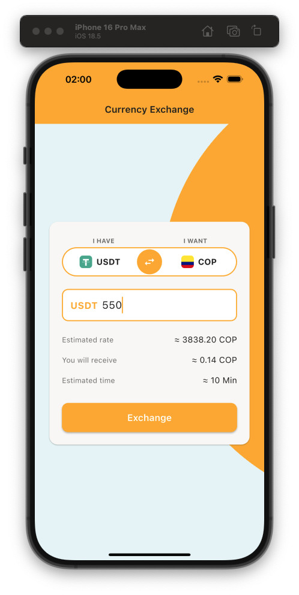

# Currency Exchange Calculator

Aplicación móvil de calculadora de cambio de divisas desarrollada en Flutter, que permite conversiones entre criptomonedas (CRYPTO) y monedas fiat (FIAT) en tiempo real.

## 📱 Estado Actual de la Aplicación

<p align="center">
  
  <br>
  <em>Implementación actual en el branch <code>development</code></em>
</p>

## 📋 Tabla de Contenidos

- [Características](#características)
- [Requisitos Previos](#requisitos-previos)
- [Instalación](#instalación)
- [Estructura del Proyecto](#estructura-del-proyecto)
- [Arquitectura](#arquitectura)
- [Tecnologías y Herramientas](#tecnologías-y-herramientas)
- [Internacionalización](#internacionalización)
- [Testing](#testing)
- [Git Hooks](#git-hooks)
- [Comandos Útiles](#comandos-útiles)
- [Convenciones de Código](#convenciones-de-código)

---

## ✨ Características

- 💱 Conversión en tiempo real entre criptomonedas y monedas fiat
- 🔄 Intercambio rápido de monedas con botón swap
- 🎨 UI moderna y responsive basada en diseños específicos
- 🌍 Soporte multiidioma (Español, Inglés, Portugués)
- 🏗️ Arquitectura limpia y escalable
- ✅ Cobertura de tests completa (unit, widget, integration)
- 🎯 Type-safe con generación de código
- 📱 Optimizado para dispositivos móviles (iOS y Android)

---

## 🔧 Requisitos Previos

- **Flutter SDK**: >= 3.16.0
- **Dart SDK**: >= 3.0.0 < 4.0.0
- **IDE**: VS Code o Android Studio con plugins de Flutter
- **Emulador/Dispositivo**: iOS Simulator, Android Emulator, o dispositivo físico

---

## 📦 Instalación

### 1. Clonar el repositorio

```bash
git clone <repository-url>
cd coding_interview_dorado
```

### 2. Instalar dependencias

```bash
flutter pub get
```

### 3. Generar código

```bash
flutter pub run build_runner build --delete-conflicting-outputs
```

### 4. Ejecutar la aplicación

```bash
# Debug
flutter run

# Seleccionar dispositivo específico
flutter run -d <device_id>
```

---

## 📁 Estructura del Proyecto

```
lib/
├── main.dart                      # Punto de entrada de la aplicación
├── app.dart                       # Configuración principal de la app
├── core/                          # Funcionalidades compartidas
│   ├── config/                    # Configuraciones de la app
│   ├── constants/                 # Constantes globales
│   │   └── currency_constants.dart # Mapeo de IDs de monedas
│   ├── di/                        # Inyección de dependencias (GetIt + Injectable)
│   ├── errors/                    # Manejo de errores y excepciones
│   ├── network/                   # Configuración de Dio
│   ├── routes/                    # Configuración de GoRouter
│   └── utils/                     # Utilidades y helpers
├── features/                      # Features organizados por funcionalidad
│   └── currency_exchange/         # Feature de cambio de divisas
│       ├── data/                  # Capa de datos
│       │   ├── datasources/       # Fuentes de datos (API)
│       │   ├── models/            # Modelos con serialización JSON
│       │   └── repositories/      # Implementación de repositorios
│       ├── domain/                # Capa de dominio (lógica de negocio)
│       │   ├── entities/          # Entidades de negocio
│       │   ├── repositories/      # Interfaces de repositorios
│       │   └── usecases/          # Casos de uso
│       └── presentation/          # Capa de presentación
│           ├── pages/             # Páginas completas
│           ├── widgets/           # Widgets reutilizables
│           ├── providers/         # Gestores de estado (Riverpod)
│           └── state/             # Definiciones de estados (Freezed)
├── shared/                        # Elementos compartidos entre features
│   ├── widgets/                   # Widgets globales reutilizables
│   └── theme/                     # Temas, colores, estilos de texto
└── l10n/                          # Archivos de localización
    ├── app_es.arb                 # Español (por defecto)
    ├── app_en.arb                 # Inglés
    └── app_pt.arb                 # Portugués

test/                              # Tests
├── unit/                          # Tests unitarios
│   ├── data/                      # Tests de repositorios y datasources
│   ├── domain/                    # Tests de entities y use cases
│   └── presentation/              # Tests de providers
├── widget/                        # Tests de widgets
└── integration/                   # Tests de integración (flujos completos)

integration_test/                  # Tests de integración end-to-end
└── app_test.dart
```

---

## 🏗️ Arquitectura

### Clean Architecture + Feature-First Structure

El proyecto sigue **Clean Architecture** combinado con una estructura **Feature-First**, organizando el código en capas:

#### 1. **Presentation Layer** (Capa de Presentación)
- **Responsabilidad**: UI, widgets, páginas, gestión de estado
- **Tecnologías**: Flutter widgets + Riverpod
- **Componentes**:
  - `pages/`: Pantallas completas
  - `widgets/`: Componentes reutilizables
  - `providers/`: Gestores de estado con Riverpod
  - `state/`: Estados inmutables con Freezed

#### 2. **Domain Layer** (Capa de Dominio)
- **Responsabilidad**: Lógica de negocio pura, independiente de frameworks
- **Componentes**:
  - `entities/`: Objetos de negocio
  - `repositories/`: Interfaces (contratos)
  - `usecases/`: Casos de uso específicos

#### 3. **Data Layer** (Capa de Datos)
- **Responsabilidad**: Acceso a datos, comunicación con API
- **Componentes**:
  - `models/`: Modelos con serialización JSON
  - `datasources/`: Fuentes de datos (remote/local)
  - `repositories/`: Implementaciones de interfaces del dominio

#### 4. **Core Layer**
- **Responsabilidad**: Funcionalidades transversales
- **Componentes**: DI, configuraciones, constantes, networking, rutas

#### 5. **Shared Layer**
- **Responsabilidad**: Elementos compartidos entre features
- **Componentes**: Widgets globales, tema, estilos

---

## 🛠️ Tecnologías y Herramientas

### State Management
- **flutter_riverpod** (^2.4.9): State management reactivo y type-safe
- **riverpod_annotation** (^2.3.3): Code generation para providers

### Navegación
- **go_router** (^13.0.0): Routing declarativo y type-safe

### Dependency Injection
- **get_it** (^7.6.4): Service locator
- **injectable** (^2.3.2): Code generation para DI

### Networking
- **dio** (^5.4.0): Cliente HTTP
- **retrofit** (^4.0.3): Type-safe API client
- **pretty_dio_logger** (^1.3.1): Logging de requests

### Data Modeling
- **freezed** (^2.4.6): Clases inmutables y union types
- **json_annotation** (^4.8.1): Serialización JSON
- **equatable** (^2.0.5): Comparación de igualdad

### Internacionalización
- **flutter_localizations**: Localización oficial de Flutter
- **intl**: Manejo de formatos y traducciones

### Testing
- **mockito** (^5.4.4): Mocking para unit tests
- **flutter_test**: Framework de testing
- **integration_test**: Tests end-to-end

### Linting
- **very_good_analysis** (^5.1.0): Reglas de análisis estático
- **flutter_lints** (^3.0.1): Lints recomendados

### Code Generation
- **build_runner** (^2.4.7): Generación de código

---

## 🌍 Internacionalización

La aplicación soporta múltiples idiomas utilizando el sistema oficial de localización de Flutter.

### Idiomas Soportados

- 🇪🇸 **Español** (es) - Idioma por defecto
- 🇬🇧 **Inglés** (en)
- 🇧🇷 **Portugués** (pt)

### Configuración

Los archivos de localización se encuentran en `lib/l10n/`:

```
lib/l10n/
├── app_es.arb  # Español
├── app_en.arb  # Inglés
└── app_pt.arb  # Portugués
```

### Agregar un Nuevo Idioma

1. Crear archivo `app_<locale>.arb` en `lib/l10n/`
2. Copiar estructura de `app_es.arb`
3. Traducir todos los textos
4. Agregar locale en `app.dart`:
   ```dart
   supportedLocales: const [
     Locale('es'),
     Locale('en'),
     Locale('pt'),
     Locale('fr'), // Nuevo idioma
   ],
   ```
5. Generar código: `flutter pub get`

### Uso en el Código

```dart
import 'package:coding_interview_dorado/l10n/app_localizations.dart';

// En un widget
final l10n = AppLocalizations.of(context)!;
Text(l10n.appTitle); // Texto localizado
```

---

## ✅ Testing

El proyecto incluye una suite completa de tests con cobertura de:

### Test Structure

```
test/
├── unit/                                    # Tests unitarios
│   ├── data/
│   │   └── repositories/
│   │       └── currency_repository_impl_test.dart
│   ├── domain/
│   │   ├── entities/
│   │   │   └── exchange_rate_entity_test.dart
│   │   └── usecases/
│   │       └── get_exchange_rate_usecase_test.dart
│   └── presentation/
│       └── providers/
│           └── currency_exchange_provider_test.dart
├── widget/                                  # Tests de widgets
│   └── widgets/
│       ├── amount_input_widget_test.dart
│       └── currency_selector_widget_test.dart
└── integration/                             # Tests de integración (opcional)

integration_test/
└── app_test.dart                           # Tests end-to-end
```

### Ejecutar Tests

```bash
# Todos los tests
flutter test

# Con reporte de coverage
flutter test --coverage

# Tests unitarios
flutter test test/unit/

# Tests de widgets
flutter test test/widget/

# Tests de integración
flutter test integration_test/
```

### Mocks

Los mocks se generan automáticamente con **Mockito**:

```bash
flutter pub run build_runner build --delete-conflicting-outputs
```

Los archivos `.mocks.dart` se generan junto a sus tests correspondientes.

### Cobertura

Objetivo: **> 80%** de cobertura de código

Excluidos de coverage:
- Archivos generados (`*.g.dart`, `*.freezed.dart`, `*.config.dart`)
- `main.dart`
- `injection.config.dart`

---

## 🪝 Git Hooks

El proyecto utiliza **Lefthook** para automatizar validaciones antes de cada commit.

### Configuración

Archivo: `lefthook.yml`

```yaml
pre-commit:
  commands:
    format:
      run: dart format lib/ test/
    analyze:
      run: flutter analyze
    test:
      run: flutter test
```

### Validaciones Automáticas

Cada vez que haces un commit, se ejecutan:

1. ✅ **Formateo de código**: `dart format`
2. ✅ **Análisis estático**: `flutter analyze`
3. ✅ **Ejecución de tests**: `flutter test`

### Instalación de Hooks

```bash
# Instalar Lefthook (primera vez)
brew install lefthook  # macOS
# o
curl -1sLf 'https://dl.cloudsmith.io/public/evilmartians/lefthook/setup.deb.sh' | sudo -E bash
sudo apt install lefthook  # Linux

# Instalar hooks en el proyecto
lefthook install
```

---

## 📝 Comandos Útiles

### Desarrollo

```bash
# Ejecutar app en modo debug
flutter run

# Ejecutar en dispositivo específico
flutter devices
flutter run -d <device_id>

# Hot reload (durante ejecución)
# Presionar 'r' en la terminal

# Hot restart (durante ejecución)
# Presionar 'R' en la terminal
```

### Code Generation

```bash
# Generar código una vez
flutter pub run build_runner build --delete-conflicting-outputs

# Watch mode (regenera automáticamente)
flutter pub run build_runner watch --delete-conflicting-outputs

# Limpiar archivos generados
flutter pub run build_runner clean
```

### Análisis y Formato

```bash
# Análisis estático
flutter analyze

# Formatear código
dart format lib/ test/

# Fix automático de problemas
dart fix --apply
```

### Testing

```bash
# Todos los tests
flutter test

# Tests con coverage
flutter test --coverage

# Tests específicos
flutter test test/unit/domain/
flutter test test/widget/widgets/amount_input_widget_test.dart

# Integration tests
flutter test integration_test/
```

### Limpieza

```bash
# Limpiar build artifacts
flutter clean

# Re-instalar dependencias
flutter pub get
```

---

## 📐 Convenciones de Código

### Nomenclatura de Archivos

- **Formato**: `snake_case.dart`
- **Sufijos descriptivos**:
  - `_page.dart` → Páginas
  - `_widget.dart` → Widgets
  - `_model.dart` → Modelos de datos
  - `_entity.dart` → Entidades de dominio
  - `_repository.dart` → Interfaces de repositorios
  - `_repository_impl.dart` → Implementaciones
  - `_datasource.dart` → Fuentes de datos
  - `_usecase.dart` → Casos de uso
  - `_provider.dart` → Providers de Riverpod
  - `_state.dart` → Estados

**Ejemplos**:
```
currency_exchange_page.dart
currency_selector_widget.dart
exchange_rate_model.dart
currency_repository_impl.dart
```

### Nomenclatura de Clases

- **Formato**: `PascalCase`
- Nombres descriptivos y específicos

**Ejemplos**:
```dart
CurrencyExchangePage
CurrencySelectorWidget
GetExchangeRateUseCase
CurrencyRepositoryImpl
```

### Nomenclatura de Variables y Métodos

- **Variables**: `lowerCamelCase`
- **Métodos**: `lowerCamelCase` (verbo + sustantivo)
- **Constantes**: `lowerCamelCase` o `UPPER_SNAKE_CASE`

**Ejemplos**:
```dart
// Variables
String selectedCurrency;
double exchangeRateValue;
bool isLoading;

// Métodos
void fetchExchangeRate() {}
double calculateConversion() {}
bool validateAmount() {}

// Constantes
const String apiBaseUrl = '...';
const double minAmount = 0.01;
static const String API_KEY = '...';
```

### Conventional Commits

**Formato**: `<type>(<scope>): <subject>`

**Types**:
- `feat`: Nueva funcionalidad
- `fix`: Corrección de bug
- `docs`: Documentación
- `style`: Formato (no afecta código)
- `refactor`: Refactorización
- `test`: Tests
- `chore`: Mantenimiento

**Ejemplos**:
```
feat(exchange): add currency selector widget
fix(api): handle network timeout errors
test(exchange): add unit tests for conversion logic
docs(readme): update setup instructions
```

### Linting

Configuración en `analysis_options.yaml`:

- Base: `very_good_analysis`
- Excluir: `*.g.dart`, `*.freezed.dart`, `*.config.dart`
- Reglas personalizadas:
  - `prefer_single_quotes: true`
  - `always_use_package_imports: true`
  - `avoid_print: true`

---

## 🔗 API

La aplicación consume el API público de Dorado para obtener tasas de cambio en tiempo real.

**Endpoint**:
```
https://74j6q7lg6a.execute-api.eu-west-1.amazonaws.com/stage/orderbook/public/recommendations
```

**Query Parameters**:
- `type`: `0` (CRYPTO→FIAT) o `1` (FIAT→CRYPTO)
- `cryptoCurrencyId`: ID de la criptomoneda
- `fiatCurrencyId`: ID de la moneda fiat
- `amount`: Cantidad a convertir
- `amountCurrencyId`: Moneda del monto de entrada

**Response**: Se extrae `data.byPrice.fiatToCryptoExchangeRate` para los cálculos.

### Mapeo de Monedas

Los IDs de las monedas se definen en `lib/core/constants/currency_constants.dart`:

```dart
// Ejemplo
'USDT' → 'TATUM-TRON-USDT'
'COP' → 'COP'
```

---

## 🎨 Theme y Diseño

### Paleta de Colores

- **Primary**: `#FDB022` (Naranja/Amarillo)
- **Background**: `#E8F5F7` (Cyan claro)
- **Card Background**: `#FAF8F6` (Beige claro)
- **Text Primary**: `#212121`
- **Text Secondary**: `#757575`

### Responsive Design

- **Mobile**: 0 - 450px
- **Tablet**: 451 - 800px
- **Desktop**: 801 - 1920px

Estrategia: **Mobile-first** con adaptaciones para tablets.

---

## 🤝 Contribuir

1. Fork el proyecto
2. Crea una rama para tu feature: `git checkout -b feature/amazing-feature`
3. Commit tus cambios: `git commit -m 'feat(scope): add amazing feature'`
4. Push a la rama: `git push origin feature/amazing-feature`
5. Abre un Pull Request

Asegúrate de que:
- ✅ Los tests pasen: `flutter test`
- ✅ El análisis pase sin warnings: `flutter analyze`
- ✅ El código esté formateado: `dart format lib/ test/`
- ✅ Los commits sigan Conventional Commits

---

## 📄 Licencia

Este proyecto es parte de una prueba técnica para Dorado.

---

## 📞 Contacto

Para cualquier duda sobre el proyecto, contactar a: [https://www.linkedin.com/in/carlosfontest/](https://www.linkedin.com/in/carlosfontest/)

---

**Desarrollado con ❤️ usando Flutter**
